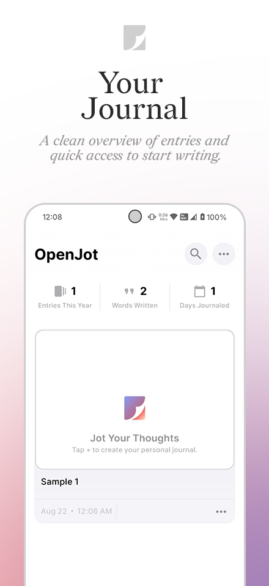
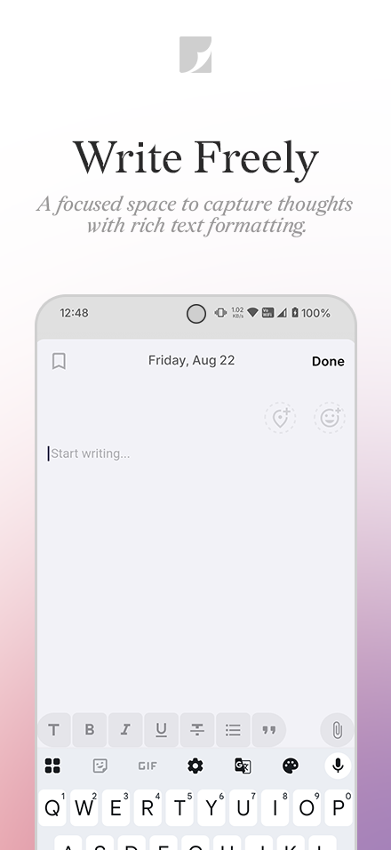
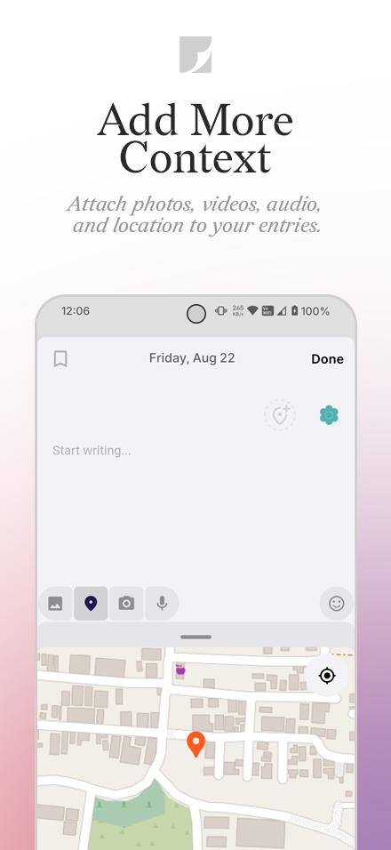
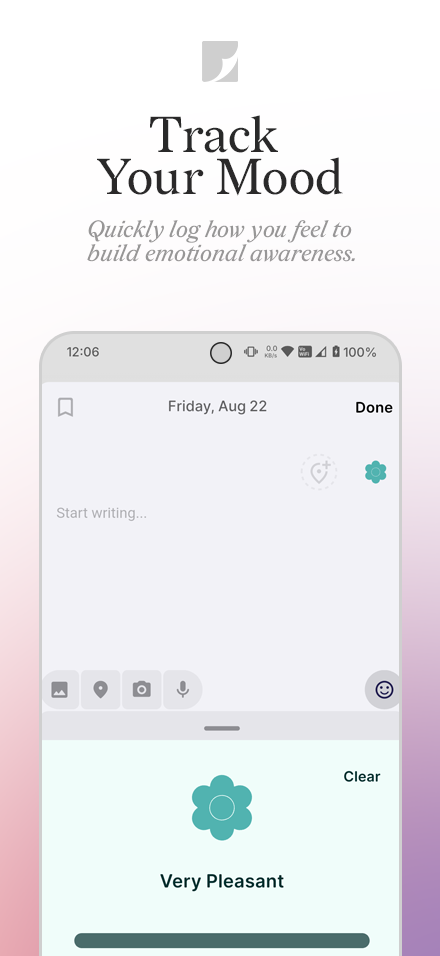
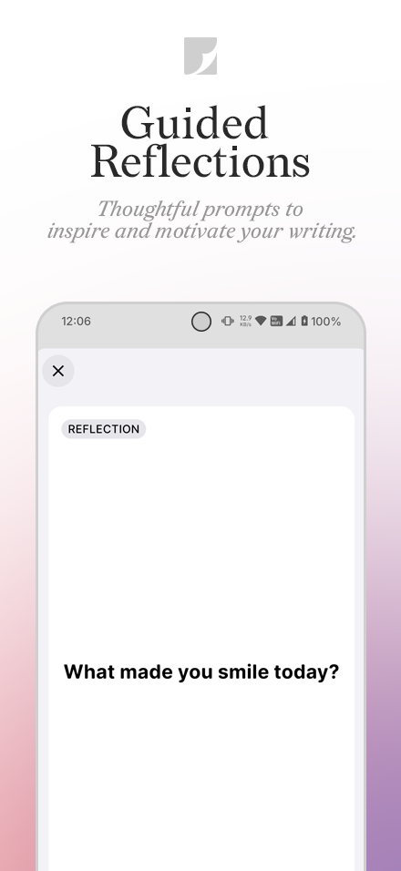

#  OpenJot

  
  
  
  

  
  
  

  

**OpenJot** is an open-source journaling app built with a minimal UI, focused on privacy and simplicity.  
Everything is stored securely on your device—never in the cloud.

---

## Features

- **Rich Text Editor** – Create beautifully formatted journal entries with `flutter_quill`.
- **Media Attachments** – Add images, videos, and audio recordings.
- **Location Tagging** – Keep track of where each memory was created.
- **Secure & Private** – Data is stored locally with Hive and can be protected with biometrics.
- **Export & Share** – Save or share entries as clean, well-formatted PDF files.
- **Modern Interface** – A clean, minimal design focused on writing.
- **Language Support** – Currently supports **English only**.

---

## Screenshots

  
  
  
  
  
  

---

## Privacy

OpenJot has a **strict no data collection policy**.  
Your journal entries, media, and preferences remain **only on your device**.  
No servers. No analytics. No compromise.

---

## Technology Stack

- **Flutter** – Cross-platform framework
- **Dart** – Programming language
- **GetX** – State management and routing
- **Hive** – Lightweight and secure local NoSQL database
- **flutter_quill** – Rich text editor
- **flutter_map** – Mapping and location visualization (using **OpenStreetMap**)

---

## Getting Started

1. Download the latest APK from the [Releases Page](https://github.com/TheGandabherunda/OpenJot/releases).
2. Install it on your Android device.
3. Open **OpenJot** and start writing.

> Note: The app currently supports **English only**.

---

## Contributing

Contributions are welcome.  
You can:
- Report issues
- Suggest new features
- Submit pull requests

---

## License

This project is licensed under the [Apache License 2.0](https://www.apache.org/licenses/LICENSE-2.0).

---

## Credits

Built with **Flutter, GetX, Hive, flutter_quill, flutter_map**, and the open-source community.  
Map data © [OpenStreetMap](https://www.openstreetmap.org/copyright) contributors.  
Made with care to protect your privacy.
